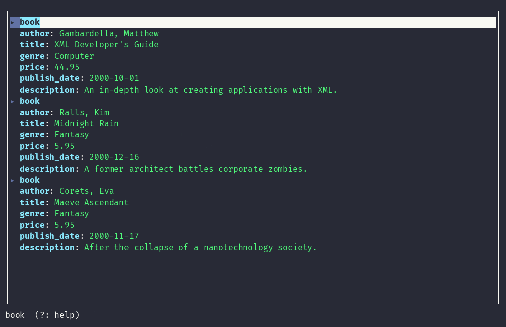

# treeq

[](https://github.com/ognjen-vuceljic/treeq/actions/workflows/ci.yml)
[](LICENSE)

**A keyboard-driven tree view for JSON and XML, in your terminal.** Built
for humans who are tired of squinting at minified blobs, and for coding
agents that need to explore a large document without dumping the whole
thing into a tool result.


## Contents

- [Why treeq](#why-treeq)
- [Install](#install)
- [Usage](#usage)
- [Features](#features)
- [TUI keybindings](#tui-keybindings)
- [Roadmap](#roadmap)
- [Contributing](#contributing)
- [License](#license)

## Why treeq

Minified, deeply-nested API responses and config files are hard to read in
a plain terminal. `treeq` parses JSON or XML and gives you a real,
navigable tree — either a static, scriptable render, or a fast interactive
TUI — instead of a wall of brackets.

`jq` is the tool for *transforming and extracting* JSON; `treeq` solves the
step before that: "what does this even look like?" — seeing the shape of
an unfamiliar payload before you write the `jq` filter that extracts what
you need. Think of it as `jq`'s companion, not its replacement, in the
niche also occupied by tools like `jless` or `otree` — but covering JSON
*and* XML in one tool, with CLI flags (`--path`, `--depth`, `--stats`,
`--agent`) built so a coding agent can explore a large document in bounded
slices instead of dumping the whole thing into a tool result.

## Install

**Homebrew:**

```sh
brew tap ognjen-vuceljic/treeq
brew install treeq
```

**From source** (requires a recent stable Rust toolchain, edition 2024):

```sh
git clone https://github.com/ognjen-vuceljic/treeq.git
cd treeq
cargo build --release
./target/release/treeq --help
```

## Usage

```sh
treeq file.json                       # interactive TUI in a terminal
cat file.json | treeq --static        # plain tree, for piping/scripting
treeq file.json --path user.address   # only that subtree
treeq file.json --depth 2             # truncate deep nesting
treeq file.json --stats               # size/shape summary, no full dump
treeq file.json --agent               # stats + shallow tree, in one call
treeq file.xml                        # XML works the same way
```

```sh
$ treeq --static sample.json
root
├── user
│   ├── name: "Alice"
│   ├── roles
│   │   ├── [0]: "admin"
│   │   └── [1]: "editor"
│   └── address
│       ├── city: "London"
│       └── zip: "E1 6AN"
└── active: true
```

In a real terminal, output is colorized by type (keys, strings, numbers,
booleans, null each a distinct color), and dropping `--static` opens the
interactive TUI instead.

### XML in action

XML works the same way as JSON, all through the same keybindings:



## Features

- **JSON and XML**, auto-detected, plus YAML and NDJSON via explicit flags.
- **Search** — incremental fuzzy search (`/`, e.g. "nme" finds "name") for
  quick jumps, plus an fzf-style popup (`F`) listing *every* match across
  the whole document — including collapsed subtrees and truncated arrays —
  matching on key, value, or a fragment spanning both.
- **Fast navigation** — count-prefixed jumps (`g20↓`), collapse/expand one
  node, an ancestor chain, or everything at once.
- **8-color node tagging** (`1`-`8`) for marking spots mid-investigation,
  clearable in bulk (`x`).
- **Copy what you're looking at** — yank the current path (`y`, via OSC 52)
  or a ready-to-run jq filter (`Y`).
- **Inspect mode** (`i`) — a node's type, size, full path, and tag.
- **Agent-friendly flags** — `--path`, `--depth`, `--stats`, `--paths`,
  `--schema`, and `--agent` (bundles stats + a shallow tree in one
  non-interactive call) for exploring a document in bounded slices instead
  of dumping it whole. `--paths` pairs naturally with
  [`fzf`](https://github.com/junegunn/fzf):
  ```sh
  treeq --path "$(treeq --paths file.json | fzf)" file.json
  ```
- **Type-aware colors**, auto-disabled when output isn't a terminal or
  `NO_COLOR` is set — and type stays recoverable from plain text alone
  (strings quoted, numbers/booleans/null bare), for piped output,
  colorblind users, and agents reading color-stripped text.

## TUI keybindings

| Key | Action |
|---|---|
| `↑` / `↓` | Move cursor |
| `g` | Count-prefixed jump: type digits, then `↑`/`↓` to move that many lines |
| `Tab` / `Space` | Collapse/expand current node |
| `Backspace` | Collapse nearest parent, move cursor there |
| `Shift+C` | Collapse every ancestor up to the root |
| `c` | Collapse all |
| `e` | Expand all |
| `/` | Incremental fuzzy search |
| `F` | Open an fzf-style popup listing every match across the whole document (`Tab`/`Shift+Tab` cycles, `Enter` jumps, `Esc` closes) |
| `i` | Inspect the current node: type, size, full path, and tag |
| `1-8` | Tag/untag current node with a highlight color |
| `x` | Clear every active tag at once |
| `y` | Yank current node's dotted path to clipboard (OSC 52) |
| `Y` | Yank current node as a jq filter, e.g. `.user.tags[0]` (JSON/YAML only) |
| `?` | Toggle the in-app keybinding help overlay |
| `q` / `Esc` | Quit |

The status bar shows a `?: help` hint whenever it isn't displaying a
search prompt or a status message, so you don't need to remember this
table while using the TUI.

## Roadmap

Open design/feature ideas are tracked as
[GitHub issues](https://github.com/ognjen-vuceljic/treeq/issues) — covering
TUI ergonomics, agent-friendliness, and format support. Contributions and
issue discussion welcome.

## Contributing

See [CONTRIBUTING.md](CONTRIBUTING.md) for code style and conventions.
`cargo fmt` and `cargo clippy --all-targets -- -D warnings` must be clean,
and `cargo test` must pass — CI enforces both on every PR.

## License

[MIT](LICENSE)
